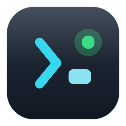
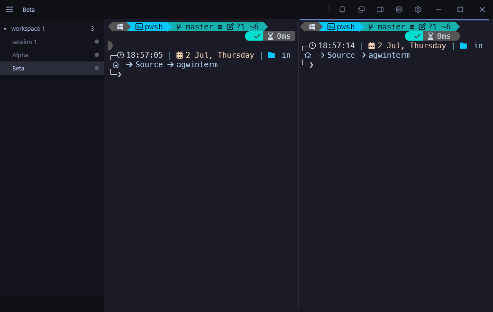

<div align="center">



# agwinterm

**A native Windows terminal built for AI coding agents.**

Workspaces, sessions, splits, live agent-status, a scriptable control API, full screen-reader
accessibility, and OS default-terminal integration — in a fast, custom-drawn Win32 + Direct2D shell.
A Windows homage to [umputun's **agterm**](https://github.com/umputun/agterm).

[](https://github.com/yeroo/agwinterm/actions/workflows/ci.yml)
[](https://scorecard.dev/viewer/?uri=github.com/yeroo/agwinterm)
[](https://github.com/yeroo/agwinterm/releases)
[](https://github.com/yeroo/agwinterm/releases)
[](LICENSE)



</div>

---

## 💜 Kudos to umputun and agterm

agwinterm exists because of **[umputun](https://github.com/umputun)** and his terminal
**[agterm](https://github.com/umputun/agterm)**. agterm's design — a terminal that treats AI coding
agents as first-class citizens, with per-session status, a sidebar of workspaces, a quick terminal,
and a language-agnostic control socket — is the blueprint this project follows on Windows.

This is an **independent, from-scratch implementation** written in C# on a native Win32/Direct2D
stack (agterm is Swift on libghostty); no agterm code is used. It is a **tribute and a port of the
ideas/UX**, built so Windows users can have the same agent-first workflow. If you're on macOS, go use
the real thing: **[github.com/umputun/agterm](https://github.com/umputun/agterm)**. Thank you, umputun. 🙏

---

## Highlights

### Agent-first
- **Workspaces → sessions → panes** in a custom-drawn sidebar (drag-reorder, rename, flag, focus,
  unread badges, **multi-select with Ctrl/Shift+click** for batch flag / move / close, reopen closed
  sessions *and workspaces* with `Ctrl+Shift+R`).
- **Dashboard** (`Ctrl+Shift+D`): a grid of **live** session previews — arrow-navigate, Enter or
  double-click to jump in; or drive it with `agwintermctl dashboard <ids>`.
- **Agent status** per session (idle / active / blocked / completed) as a colored dot + title-bar
  bell — driven by your agent via hooks or the control API, with blink, auto-reset, and sounds.
  Run `agwintermctl install hooks` (or the palette entry) once to wire Claude Code / Codex up.
- **Claude Code session binding & auto-resume**: the same installer adds a transparent `claude`
  wrapper (active only inside agwinterm) that ties Claude's session id to the agwinterm pane. You
  just type `claude` — a fresh pane starts a bound session, and a pane that already has a transcript
  **resumes** it. On restart, agwinterm re-launches each bound pane and the conversation comes back —
  no guessing which shell was which. Already had Claude running before installing this? Run
  `agwintermctl claude adopt` (or palette → *Make Claude Sessions Resumable*) once to bind your
  existing conversations to their panes.
- **Update Claude Code** (palette → *Update Claude Code*, or `agwintermctl claude update`): agwinterm
  quietly notices when a new Claude Code ships (npm registry; `claude-update-check = false` to opt
  out), then — on your command — runs `claude update` in an overlay terminal and **restarts every
  running Claude session**, each resuming its own conversation (YOLO panes stay YOLO).
- **agwinterm self-update** (palette → *Update agwinterm*, or `agwintermctl app update`): notices new
  releases on GitHub (`update-check = false` to opt out), then — on your command — downloads the
  right artifact for your install (installer or portable exe), **verifies its SHA-256** against the
  release digest, restarts, and your sessions restore. scoop/chocolatey installs are never touched —
  the hint points at your package manager instead.
- **A scriptable control API**: `agwintermctl` (or newline-JSON over a named pipe) — any language can
  drive it, including full **read-back** (tree with split ratios + pane ids, window state, session
  output). Opt-in installers for the **agent skill** and **Claude Code / Codex status hooks**.
- **Splits** (a split collapses to the survivor when a pane exits), **scratch** & **quick** terminals,
  ephemeral **overlays** (open/resize/close via API), **multi-window** with per-window addressing.

### A real Windows terminal
- **Default Terminal Application**: register agwinterm from *Settings → General* (per-user, no admin,
  one-click revert) and every console app you launch — `cmd` from Win+R, double-clicked `.exe`s —
  opens as an agwinterm session via the ConPTY handoff, titled by the app.
- **Fast**: sustained output at **~33k lines/s** (~87 % of a bare conhost window), 0.4 s cold start,
  ~0 % idle CPU, and a leak-hunted session lifecycle (`tools/profile-memory.ps1` keeps it honest).
- Sixel + Kitty graphics, win32-input-mode + Kitty keyboard protocol, ligatures (toggleable),
  builtin box-drawing glyphs, buffer restore, block selection + keyboard mark mode, read-only panes,
  elevated & de-elevated sessions side by side (⚡ marker), FTCS/OSC-133 prompt marks with
  jump-to-prompt, taskbar progress (OSC 9;4).
- Shells are launched with `TERM_PROGRAM=agwinterm` (+ the usual `AGWINTERM_*` vars), so prompt
  engines, tmux and scripts can detect the host terminal.

### Accessible — screen readers are first-class
- The terminal is a **UIA text document**: Narrator/NVDA read it line by line, track the caret
  (tight one-cell focus box), and **new output is announced automatically** after it settles.
- **Everything is in the UIA tree**: sessions, every chrome button, settings tabs and controls —
  scannable (Caps Lock + arrows), focusable, and invokable. Dialogs are **modally scoped** so the
  reader can't wander behind them.
- **F6** moves keyboard focus between the terminal and the session list (arrows + Enter there);
  the **Settings dialog is fully keyboard-navigable** — Tab reaches the tab headers too (Enter
  switches), with a classic keyboard-only dotted focus rectangle; buttons **speak on hover** and
  show **tooltips**.
- **F1 help** lists the *effective* keybindings and — when a reader is attached — speaks a spoken
  orientation guide for low-vision users.

### Looks & feel
- **Whole-window theming** with **~580 bundled themes** (the ghostty / iTerm2 set) — sidebar, title
  bar, and terminal retint together. **Fonts apply live** from Settings, and there's an optional
  **follow Windows light/dark** mode that swaps between a light and a dark theme you choose.
- **Configurable sidebar font size**, sidebar tint, window opacity, and inactive-pane muting.
- **cwd in the title** out of the box (composes with oh-my-posh) + an **oh-my-posh theme picker**.
- Toolbar modes (normal / compact / **hidden** full-bleed), window opacity, unfocused dim,
  per-session background watermarks.
- **MRU `Ctrl+Tab` switcher**, fuzzy **command / session / action palettes**, search, tmux-style
  **leader chords**, custom commands with `{AGW_*}` tokens and run modes.

## Install

Grab either from the [**Releases**](https://github.com/yeroo/agwinterm/releases) page:

- **`agwinterm-setup-<version>.exe`** — per-user installer (Start-menu shortcut + uninstaller).
- **`agwinterm-portable-<version>-win-x64.exe`** — **portable**: a single self-contained exe, no
  installation — run it from anywhere (settings still live under `%LOCALAPPDATA%\agwinterm`).

Both are **self-contained** (no .NET runtime needed) and need **no admin rights**.

Or install from a package manager (both use the release artifacts and self-update on new releases):

```powershell
# Scoop (portable build)
scoop bucket add agwinterm https://github.com/yeroo/scoop-bucket
scoop install agwinterm

# winget
winget install yeroo.agwinterm

# Chocolatey (portable build)
choco install agwinterm
```

- Binaries are currently **unsigned**, so SmartScreen will warn on first run → *More info → Run
  anyway*. Release artifacts carry **Sigstore build-provenance attestations** — verify with
  `gh attestation verify <file> --repo yeroo/agwinterm`.
- The installer is deliberately minimal (copies files + shortcuts). The integrations
  (put `agwintermctl` on PATH, agent status hooks, agent skill, shell integration, default-terminal
  registration) are **opt-in from inside the app** — command palette (`Ctrl+Shift+P`) or Settings.

## Build from source

Requires the **.NET 10 SDK** (see [`global.json`](global.json)) on Windows x64.

```powershell
# build + test
dotnet build Agwinterm.slnx -c Release
dotnet test  Agwinterm.slnx -c Release

# run the app
dotnet run --project src/Agwinterm.Win32 -c Release

# build the installer (needs Inno Setup 6)
./installer/build.ps1

# build the portable single-file exe (no Inno Setup needed)
./installer/build-portable.ps1
```

### Dev builds run side-by-side with the installed release

A **Debug** build uses a separate instance identity, `agwinterm-dev`, so it keeps its **own** data
dir (`%LOCALAPPDATA%\agwinterm-dev`: config, sessions, keymap, themes) and its **own** control pipe —
it never touches, or fights over the pipe with, your installed **Release** (`agwinterm`). So you can
daily-drive the release and run dev builds at the same time.

```powershell
dotnet run --project src/Agwinterm.Win32           # Debug -> the "agwinterm-dev" instance
agwintermctl --pipe agwinterm-dev tree             # drive the dev instance from outside
agwintermctl tree                                  # (default pipe) drives the release
```

Inside any session, `AGWINTERM_PIPE` is already set, so a bare `agwintermctl` auto-targets the
instance it's running in. Force a specific identity with `--app-id <name>` or `AGWINTERM_APP_ID`
(handy for a second throwaway instance). Dev builds also skip registering as the default-terminal
COM server, so they never intercept the release's console handoffs.

## Control it from anything (`agwintermctl`)

agwinterm is scriptable through a local named pipe speaking newline-delimited JSON, with
`agwintermctl` as the CLI wrapper. A few examples:

```powershell
agwintermctl tree --json                     # workspace/session tree (+ splits, badges, overlays)
agwintermctl window state                    # sidebar/fullscreen/active read-back
agwintermctl session status blocked --sound  # report agent status (a dot + bell in the UI)
agwintermctl session new --name build --workspace-name CI --create-workspace
agwintermctl session type "npm test`n"       # type into the active session
agwintermctl session overlay open "git diff" --size-percent 60
agwintermctl dashboard build test deploy     # grid overview of chosen sessions
agwintermctl theme set "Tokyo Night"         # retint the whole window
agwintermctl window new --name scratchpad    # open a second window
```

Inside a session you get `AGWINTERM_SESSION_ID`, `AGWINTERM_WINDOW_ID`, and `AGWINTERM_PIPE`.
Run `agwintermctl install skill` (or the palette entry) to teach Claude Code / Codex the full verb set.

## Keyboard essentials

| Key | Action |
|---|---|
| `F1` | Help (effective keybindings + accessibility guide) |
| `F6` | Move focus terminal ⇄ session list |
| `Ctrl+Shift+D` | Dashboard — grid of live sessions |
| `Ctrl+Shift+T` / `Ctrl+Shift+R` | New session / reopen closed |
| `Ctrl+Tab` | MRU session switcher |
| `Ctrl+D` | Split pane · `` Ctrl+` `` quick terminal · `Ctrl+J` scratch |
| `Ctrl+Shift+P` | Action palette |
| `F11` | Fullscreen |

Everything is rebindable in `keymap.conf` (see `F1` for the live list).

## Configuration

- **`%LOCALAPPDATA%\agwinterm\agwinterm.conf`** — appearance & behavior (also editable in Settings).
- **`%LOCALAPPDATA%\agwinterm\keymap.conf`** — keybindings + custom commands + leader chords.
- Themes: the bundled set ships with the app; drop extra ghostty-format `*.conf` files in
  `%LOCALAPPDATA%\agwinterm\themes\`.

## Acknowledgements

- **[umputun / agterm](https://github.com/umputun/agterm)** — the original and the inspiration for every
  bit of this project's UX. 💜
- **[Ghostty](https://ghostty.org)** & **[iTerm2-Color-Schemes](https://github.com/mbadolato/iTerm2-Color-Schemes)**
  — the bundled color themes are the community ghostty/iTerm2 set.
- **[Vortice.Windows](https://github.com/amerkoleci/Vortice.Windows)** (Direct2D/DirectWrite),
  **[Porta.Pty](https://www.nuget.org/packages/Porta.Pty)** (ConPTY), and
  **[microsoft/terminal](https://github.com/microsoft/terminal)**'s OpenConsole for the
  default-terminal handoff.

## License

[MIT](LICENSE) © 2026 Boris Kudriashov. Bundled theme files retain their upstream (iTerm2-Color-Schemes,
MIT) licensing.
