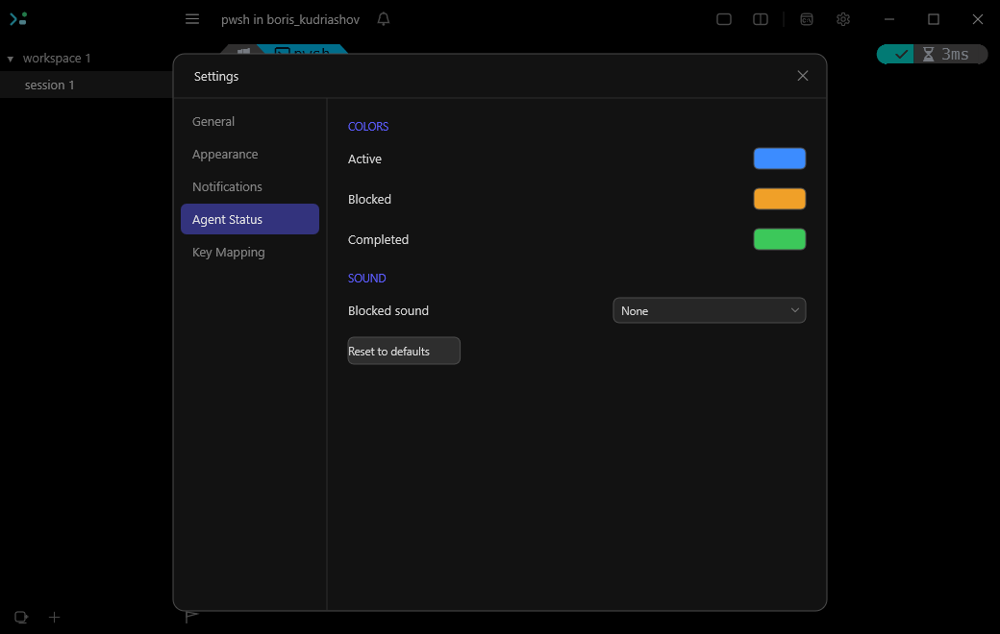

# agwinterm - a native Windows terminal built for AI coding agents

[](https://github.com/yeroo/agwinterm/actions/workflows/ci.yml)
[](https://scorecard.dev/viewer/?uri=github.com/yeroo/agwinterm)
[](https://github.com/yeroo/agwinterm/releases)
[](https://github.com/yeroo/agwinterm/releases)
[](LICENSE)

**[Releases](https://github.com/yeroo/agwinterm/releases)** · [User guide](docs/user-guide.md) · [Control API](docs/control-api.md) · [agliteterm](https://github.com/yeroo/agliteterm)

`agwinterm` is a native Windows terminal with a full control API, in a fast, custom-drawn Win32 + Direct2D shell. Shells are organized into workspaces, each holding the sessions for one project or context, and everything it holds is an object a script can address. The bundled `agwintermctl` creates sessions and types into them, reads a pane's text back, runs a program in an overlay and returns its exit status, sets a session's status, opens a dashboard, moves windows, and reads all of that state back out over a local named pipe.

The motivation is the one behind [umputun's agterm](https://github.com/umputun/agterm), which this project follows on Windows: running several coding agents at once means many long-lived sessions, each progressing on its own, and a tabbed terminal loses track of them quickly. Each agent works in a named session and reports whether it is active, blocked, or done, so it is obvious which one needs you. An installable skill teaches an agent the control model, so it can drive the terminal itself.

It is an independent, from-scratch implementation in C# (agterm is Swift on libghostty); no agterm code is used. It is also a real Windows terminal in its own right: it can be the OS default terminal, it is fully usable with a screen reader, and with nothing scripted at all it is a capable everyday terminal. On macOS, use the original: **[github.com/umputun/agterm](https://github.com/umputun/agterm)**.

What it does:

- **Workspaces and sessions.** Sessions are grouped under named workspaces in a sidebar with drag-reorder, flags, unread badges, multi-select, and reopen for closed sessions and workspaces. A live **dashboard** shows a grid of sessions at once.
- **Control API and CLI.** `agwintermctl` drives almost everything over a named pipe, with full read-back: the tree with split ratios and pane ids, window state, session output, a pane's caret column, the age of a status.
- **Splits, scratch, quick terminal and overlays.** Split a session side by side or stacked, open a scratch or a detached quick terminal, run a program in an overlay over a session or over one pane of it, or show a passive HUD.
- **Agent status and skill.** Agents report their state through hooks or the API as a colored dot and a title-bar bell. Opt-in installers add the agent skill, Claude Code / Codex status hooks, shell integration and the CLI on `PATH`.
- **Claude Code binding and auto-resume.** A `claude` wrapper ties each conversation to its pane, so a restart re-launches every bound pane and the conversation comes back. Updating Claude Code restarts every running Claude session into its own conversation.
- **Restore, and shells that survive the UI.** Sessions come back with their layout and pinned commands, and with captured commands when `restore-commands` is on. The experimental pty-host server mode keeps every shell running through a UI quit, update or crash.
- **A real Windows terminal.** Default Terminal Application registration, ~33k lines/s output, Sixel and Kitty graphics, the Kitty keyboard protocol, ligatures, elevated and de-elevated sessions side by side.
- **Accessible.** The terminal is a UIA text document for Narrator and NVDA, every control is in the UIA tree, and new output is announced.
- **Themes.** ~580 bundled themes retint the whole window, fonts apply live, and an optional mode follows Windows light/dark.

A lot of "does it have X?" questions have the same answer: bind X yourself. A `command` line in `keymap.conf` names any shell line and a `map` line binds it to a key chord or leader chord, and an overlay gives an interactive program a real terminal over the session, so a git UI or a file manager is two lines away. Install the agent skill and ask the agent in your session for what you want; it knows the syntax.


<details>
<summary>More screenshots</summary>

The Settings window, on the Agent Status tab, where the status colors and the blocked sound are chosen:



</details>

## The model

- **Window.** A top-level bundle of workspaces and sessions with its own sidebar; `agwintermctl window` addresses each one.
- **Workspace.** A named group of sessions for one project or context.
- **Session.** One running shell with a name, a working directory, an optional one-line context, and its own scrollback. It is the row you see in the sidebar, and it keeps running while you work in another one.
- **Split, scratch and quick.** A session can split into two shells side by side or stacked, both sharing its one sidebar row. A scratch terminal opens over it for a quick aside; the quick terminal is a detached window of its own.
- **Overlay.** One program running in a temporary terminal over a session, or over one pane of a split. It disappears when the program exits (unless opened with `--wait`, which keeps it until closed) and leaves the shell underneath unchanged.

## Install

Pre-built releases are for **Windows x64**. Both artifacts are self-contained (no .NET runtime needed) and need no admin rights. The package managers all use the release artifacts and self-update on new releases.

```powershell
# Scoop (portable build)
scoop bucket add agwinterm https://github.com/yeroo/scoop-bucket
scoop install agwinterm

# winget
winget install yeroo.agwinterm

# Chocolatey (portable build)
choco install agwinterm
```

Direct download, from the [releases page](https://github.com/yeroo/agwinterm/releases):

- **`agwinterm-setup-<version>.exe`** — per-user installer (Start-menu shortcut and uninstaller).
- **`agwinterm-portable-<version>-win-x64.exe`** — a single self-contained exe, no installation; settings still live under `%LOCALAPPDATA%\agwinterm`.

**winget and Chocolatey get checkpoint releases only** — versions whose patch number is a multiple of 9 (0.17.9, 0.17.18, 0.17.27...). Both are human-moderated, and this project releases faster than those queues drain. Everything in between ships as a GitHub release, and both the in-app updater and Scoop pick those up immediately, so **the fastest way to stay current is the installer or Scoop**.

Binaries are currently **unsigned**, so SmartScreen warns on first run → *More info → Run anyway*. Release artifacts carry **Sigstore build-provenance attestations**:

```powershell
gh attestation verify <file> --repo yeroo/agwinterm
```

The installer is deliberately minimal. The integrations are **opt-in from inside the app**, from the command palette (`Ctrl+Shift+P`) or Settings, and safe to rerun: *Install Command-Line Tool (PATH)*, *Install Agent Status Hooks*, *Install Agent Skill* and *Install Shell Integration* (the same four are `agwintermctl install cli|hooks|skill|shell`), and default-terminal registration in *Settings → General*.

On an older or low-RAM machine, take **[agliteterm](https://github.com/yeroo/agliteterm)** instead: half the download, no .NET at all, and the same shared control-API subset. The two install independently and can live side by side.

## Scripting agwinterm

`agwintermctl` drives a running agwinterm over a local named pipe speaking newline-delimited JSON, one command per invocation. Inside a session `AGWINTERM_PIPE` and `AGWINTERM_SESSION_ID` are already set, so a bare `agwintermctl` targets the instance and pane it runs in. Terminal output is not streamed; `session text` reads a session's buffer when a script needs to see it.

```powershell
$sid = agwintermctl session new --workspace-name demo --create-workspace --cwd $PWD --no-select  # the new session's id
agwintermctl session split on --axis horizontal --target $sid           # add a stacked shell; answers its pane id
agwintermctl session type "git status`n" --target $sid                  # drive a session you are not looking at
agwintermctl session text --target $sid --lines 10                      # read its terminal back
agwintermctl session status blocked --target $sid                       # set the sidebar status dot
agwintermctl session overlay open "lazygit" --block                     # run a program over the session, get its exit
agwintermctl tree --json                                                # dump the whole model as JSON
```

`session type` returns once the keystrokes are queued, so a following `session text` races the shell, and `session write` only paints: the program's next repaint, or any pane resize, paints over it.

The same interface covers windows, splits, overlays, dashboards, HUDs, notifications, events, themes, images and restoration. `agwintermctl --help` lists the session, sidebar, restore, surface and image verbs; the agent skill (`agwintermctl install skill`) carries the full set, and [docs/control-api.md](docs/control-api.md) documents the replies a script can rely on.

## Documentation

- [User guide](docs/user-guide.md): agent features, the terminal, accessibility, themes, keyboard essentials, and where configuration lives.
- [Control API](docs/control-api.md): a tour of `agwintermctl`, and the replies and refusals of the verbs a script leans on.
- [Launching a session command](docs/session-commands.md): `session new --command`, direct mode, `--wait`.
- [Workspace navigation](docs/navigation.md), [quick terminal](docs/quick-terminal.md), [session HUD](docs/session-hud.md), [native picker](docs/native-picker.md).
- [Default terminal](docs/defterm-testing.md): how the console handoff is exercised.
- [agterm parity](docs/agterm-parity.md) and [agliteterm parity](docs/lite-parity.md): where both products stand.
- [CONTRIBUTING.md](CONTRIBUTING.md): building from source, dev builds side by side with the release, the contract with agliteterm.

Report bugs in [Issues](https://github.com/yeroo/agwinterm/issues).

## Related projects

- **[agterm](https://github.com/umputun/agterm)** by [umputun](https://github.com/umputun) is the macOS original whose design this project follows.
- **[agliteterm](https://github.com/yeroo/agliteterm)** is the lightweight sibling, in its own repository (it was `agwinterm-lite` until 0.17.4): one small C++ exe over the same Rust emulator core and pty-host, built for machines where a .NET app is too much.

<details>
<summary>agwinterm and agliteterm, side by side</summary>

|                | **agwinterm** | **agliteterm** |
|---|---|---|
| Stack | C# / .NET, Win32 + Direct2D | C++ / Win32 + WTL, **no .NET** |
| Chrome | custom-drawn | real native controls |
| Download | 31 MB | 15 MB |
| Fonts | any TrueType, ligatures, images/sixel | bundled bitmap packs, raster-crisp at fixed sizes |
| Control API | the full set — `search`, `command run`, `dashboard`, `theme`, `image`, profiles… | the shared core (the 41 verbs of the shared contract when this table was written), incl. `events` and `session output` |
| Best for | your main machine | old, small, or remote/RDP machines |

Neither is a cut-down build of the other; they are separate programs that agreed on an interface, so a script does not have to care which one it is talking to:

- **The same portable control-API subset.** `tests/conformance/control-api.json` is the canonical spec for that subset, and **both repositories run it in CI**. agwinterm also has product-specific verbs such as `image.frameshm` and `session.metrics`; callers must capability-probe those rather than assume agliteterm implements them.
- **The same session environment.** `AGWINTERM_*` is unchanged in agliteterm, so the agent skill, status hooks and portable `agwintermctl` commands use the same targeting conventions in both.
- **The same core.** agliteterm builds against an ABI-pinned `agwinterm_core.dll` published from this repo, and refuses to build if the published `abiVersion` is not the one it requires.

Coming from `agwinterm-lite`? Nothing to do: 0.17.4's updater points at the agliteterm feed. agliteterm installs *alongside* rather than replacing it and adopts that profile's sessions, settings and fonts on first run, so nothing is lost and a rollback still works. Scripts using `--pipe agwinterm-lite` keep working: the default instance answers on both names. Releases here still carry a frozen `agwinterm-lite-setup-0.17.4.exe` so installs that predate the handover can find their way across.

</details>

## Attribution

agwinterm exists because of **[umputun](https://github.com/umputun)** and **[agterm](https://github.com/umputun/agterm)**. agterm's design — a terminal that treats AI coding agents as first-class citizens, with per-session status, workspace navigation, a detached quick terminal, a native picker, and a language-agnostic control socket — is the blueprint this project follows. agwinterm is a tribute and a port of the ideas and UX, not of the code. Thank you, umputun. 💜

- **[Ghostty](https://ghostty.org)** and **[iTerm2-Color-Schemes](https://github.com/mbadolato/iTerm2-Color-Schemes)**: the bundled color themes are the community ghostty/iTerm2 set.
- **[Vortice.Windows](https://github.com/amerkoleci/Vortice.Windows)** (Direct2D/DirectWrite), **[Porta.Pty](https://www.nuget.org/packages/Porta.Pty)** (ConPTY), and **[microsoft/terminal](https://github.com/microsoft/terminal)**'s OpenConsole for the default-terminal handoff.
- Bundled fonts, with versions and licenses, are listed in [THIRD_PARTY_FONTS.md](THIRD_PARTY_FONTS.md).

## License

[MIT](LICENSE) © 2026 Boris Kudriashov. Bundled theme files retain their upstream (iTerm2-Color-Schemes, MIT) licensing.
